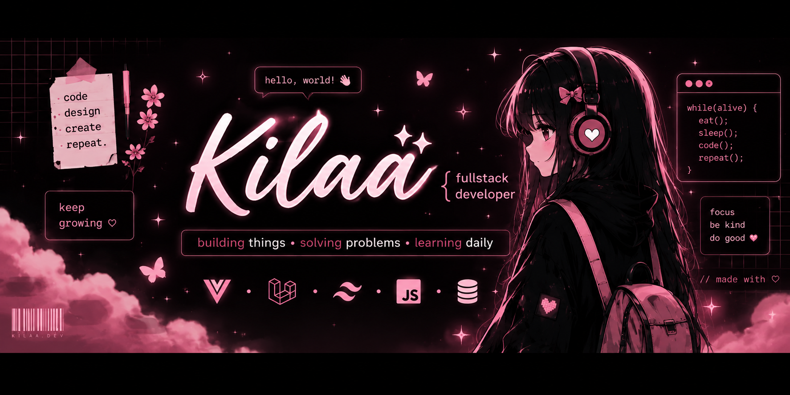

  

<h1 align="center">Hi there! I'm Kilaa 🎀</h1>

  Fullstack Developer • SIJA Student • Vue + Laravel Learner

  

🌸 About Me
- 🌱 Currently learning **Vue 3, Laravel 13, Filament**
- 💻 Building **eFurniture Fullstack Project**
- 🎨 Love coding, UI/UX, and aesthetic things
- 📫 Instagram: **@littlepixyz**

💗 Tech Stack

  
  
  
  
  

## 📌 Featured Projects
- 💗 [eFurniture-Fullstack](https://github.com/tyvinx/eFurniture-Fullstack)

  💗 Thanks for visiting my profile 💗

